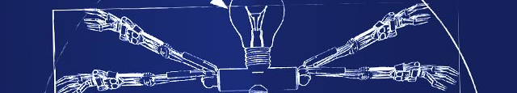

# 

## DESCRIPTION
- Guild Wars 2 combat assistant, pixel bot and toolbox.
- Set up a combat rotation and let the assistant do the combat. 95% accurate
- Use the macro recorder/player to get a minigame or simple task done. ??% accurate

## PARAMETER
- Recomended use of windowed fullscreen with 1920x1080 resolution.
- Recomended use of US/EN or standard keyboard layout.
- Set a different appname(anticheat) and adjust the key assignment in config.yml.
    For proper use of profession abillitys, change game keybinds or combat.py.
- Python 3.9 interpreter, see requirements.txt.

## USAGE
- Recomended usage is the assistant in combination with the toolbox to build a custom
    ability rotation, just use folder names in assets\skills\ like: har\ or wil\ or
    vin\ or spe\ and assign the proper ability image to the correct number.
    Take a look at src\engine\combat.py and expand the function to your needs.
- Use the macro recorder to get a minigame or simple task done, atm for testing purpose.
- With toolbox open: 'home' hotkey get coordinates and rgb colors at mouse cursor.
- With toolbox open: 'insert' hotkey save image per parameters from gui at mouse cursor.
- 'end' hotkey to exit active process.
- 'delete' or 'capslock' hotkey to pause active process. Use to toggle fight on/off.

## CREDITS
- https://stackoverflow.com
- https://github.com
- Written in Python by DarkDBx

Support me: https://patreon.com/DarkDBx
Tips here: https://paypal.me/darkdb

